# JobHunter

## Overview

JobHunter is a full-stack web application designed to help job seekers organize, monitor, and manage their job applications throughout the hiring process. Instead of relying on spreadsheets, handwritten notes, or scattered emails, JobHunter provides a centralized platform where users can efficiently record every application and monitor its progress.

Developed using **Laravel**, **React**, **TypeScript**, **Inertia.js**, and **Tailwind CSS**, JobHunter combines a secure backend with a modern and responsive frontend to deliver a seamless user experience.

---

# Problem Statement

Searching for employment often involves submitting applications to multiple companies. As the number of applications increases, it becomes difficult to remember where applications were submitted, monitor their current status, and keep important information organized.

JobHunter addresses this problem by providing a centralized job application management system that enables users to:

- Store job application records in one place.
- Track and update application information.
- Remove outdated application records.
- Perform bulk operations to improve efficiency.
- Securely manage user accounts through authentication and password recovery.

The system helps job seekers stay organized throughout their job search while reducing the risk of missing important opportunities.

---

# Features

- Secure User Authentication
- User Registration
- Login System
- Email Verification
- Forgot Password Workflow
- Password Reset via Email Verification
- Add Job Applications
- Edit Existing Applications
- Delete Individual Applications
- Batch Selection
- Batch Delete
- Search Functionality
- Application Filtering
- Pagination
- Responsive User Interface
- Interactive Modern Design

---

# Technology Stack

## Frontend

- React
- TypeScript
- Inertia.js
- Tailwind CSS

## Backend

- Laravel
- PHP

## Database

- SQlite

---

# System Screenshots

## Landing Page

The landing page introduces JobHunter and highlights its purpose before users sign in or register.

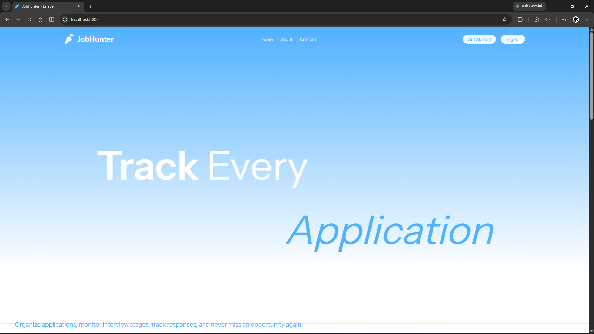

---

## Login Page

Registered users can securely access their accounts using their email and password.

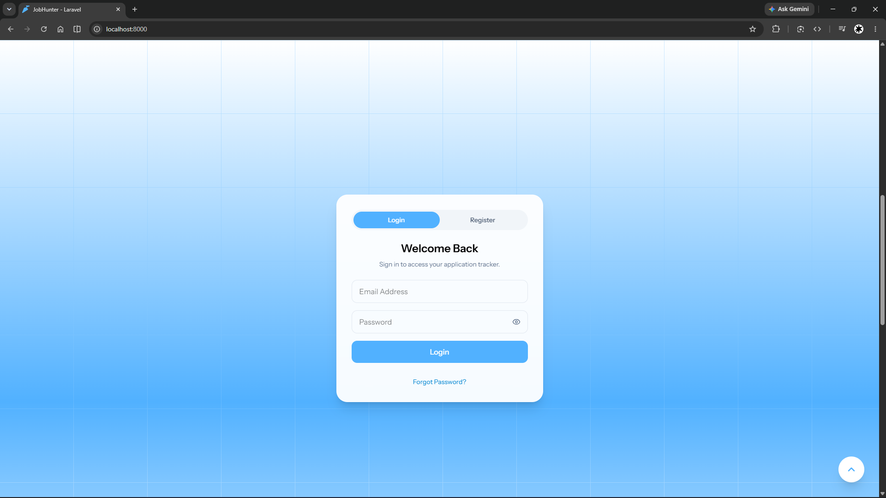

---

## Registration Page

New users can create an account before accessing the application tracking dashboard.

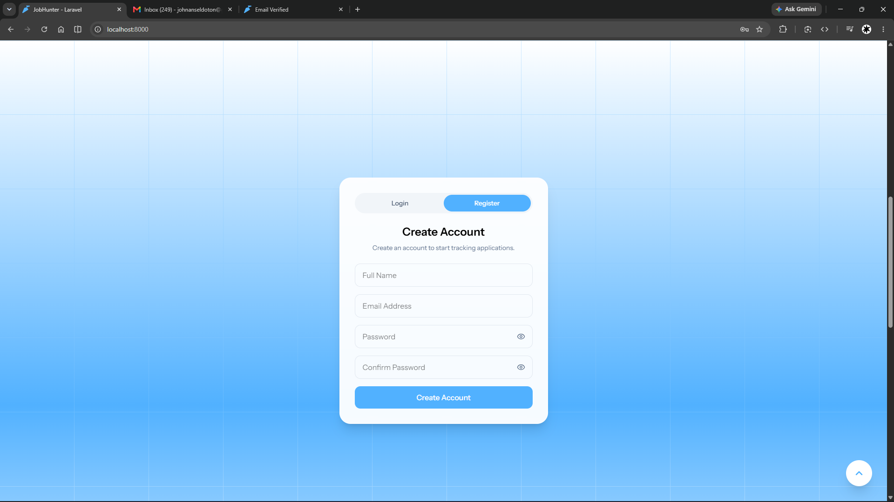

---

## Add Job Application

Users can create a new job application by entering company details, position, status, and other relevant information.

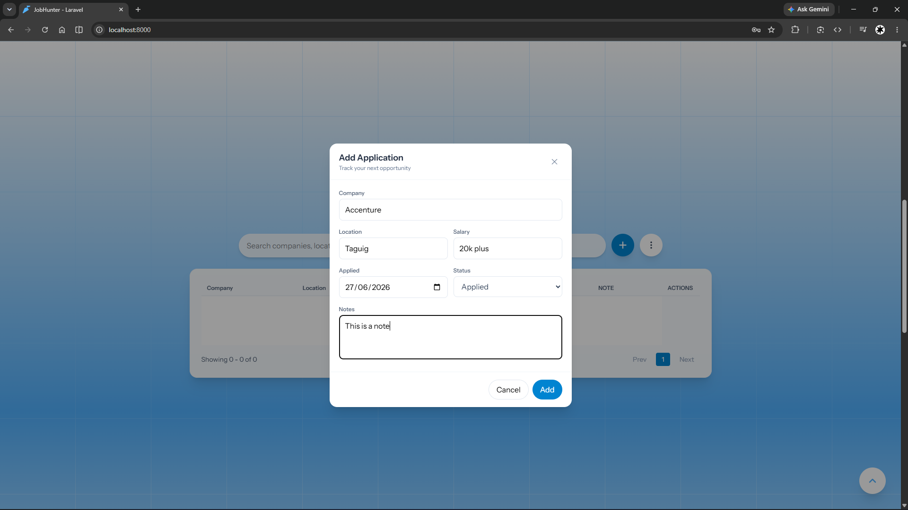

---

## Edit Job Application

Existing application records can be modified whenever updates are needed.

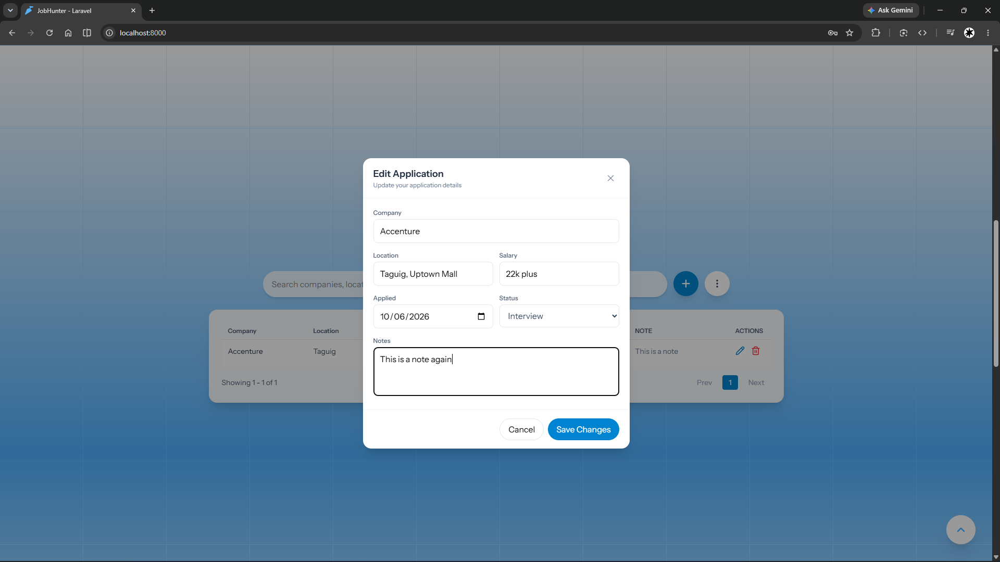

---

## Delete Job Application

A confirmation dialog helps prevent accidental deletion of application records.

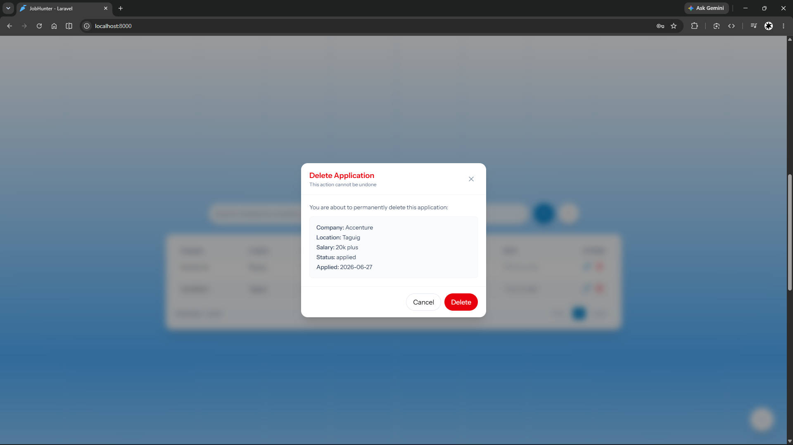

---

## Batch Operations

Users can select multiple application records simultaneously to perform bulk actions.

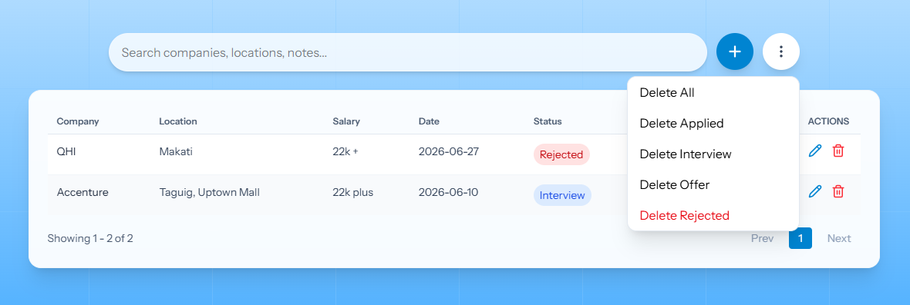

---

## Batch Delete

Selected application records can be deleted through a single confirmation dialog.

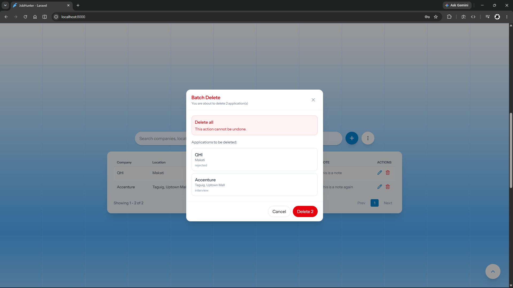

---

## Forgot Password

Users who forget their password can initiate the recovery process by entering their registered email address.

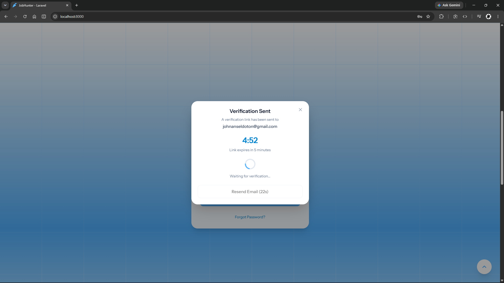

---

## Verification Email Sent

The system confirms that a verification email has been successfully sent.

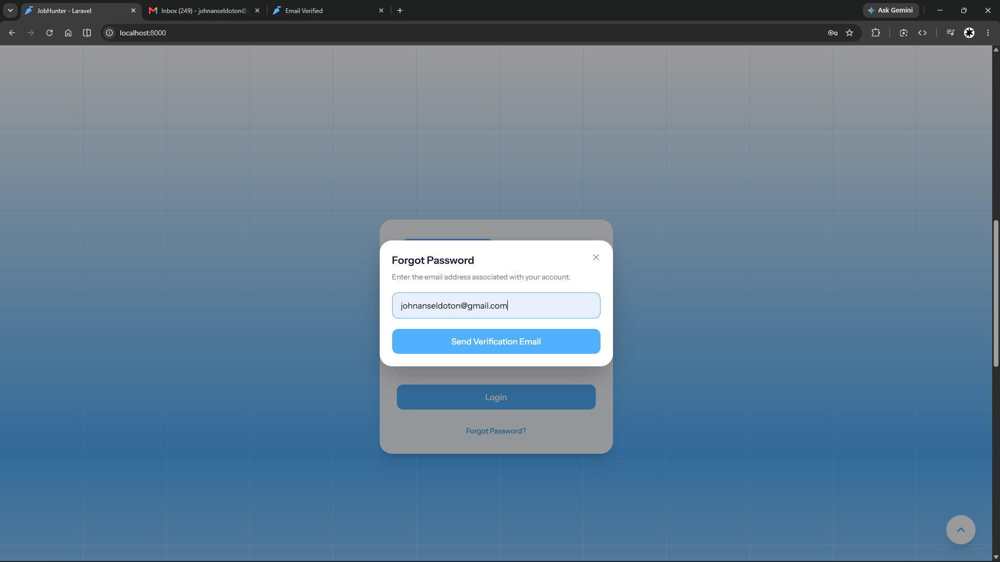

---

## Email Verification

Users verify ownership of their email by opening the verification link sent to their inbox.

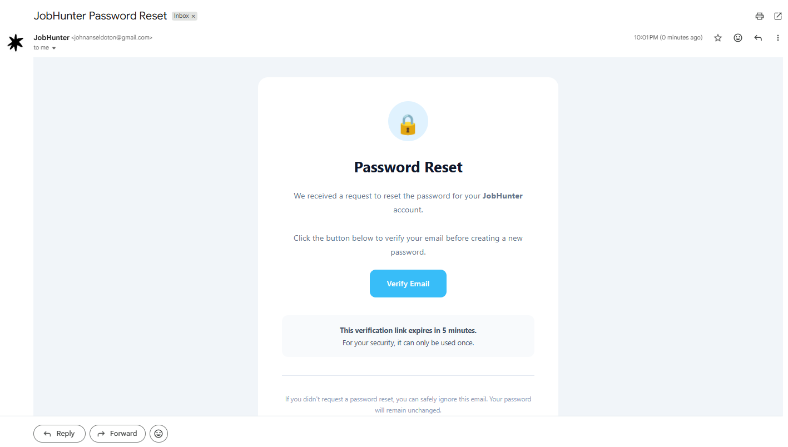

---

## Verification Successful

Once verification is complete, users are authorized to reset their password.

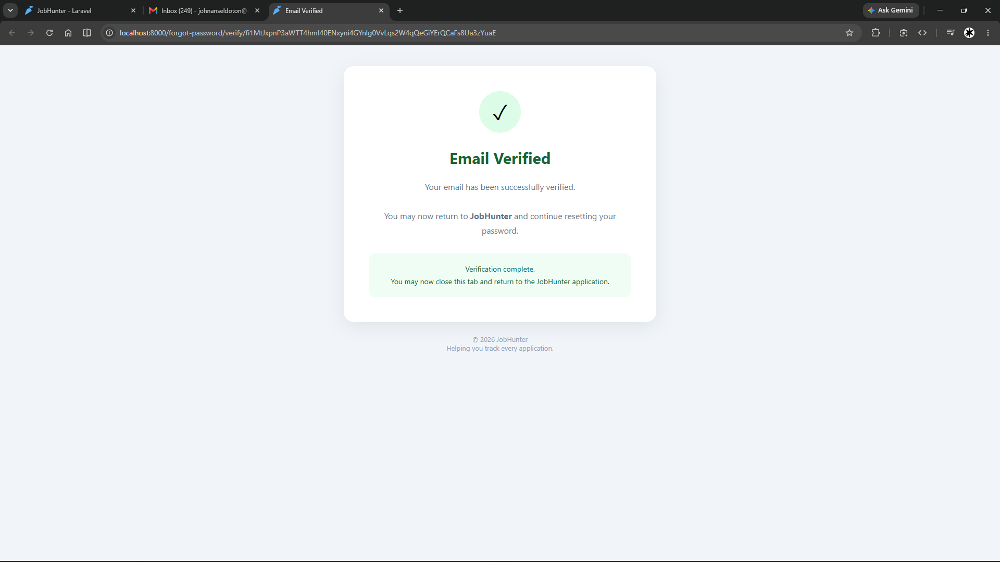

---

## Reset Password

Users create a new secure password before logging back into the system.

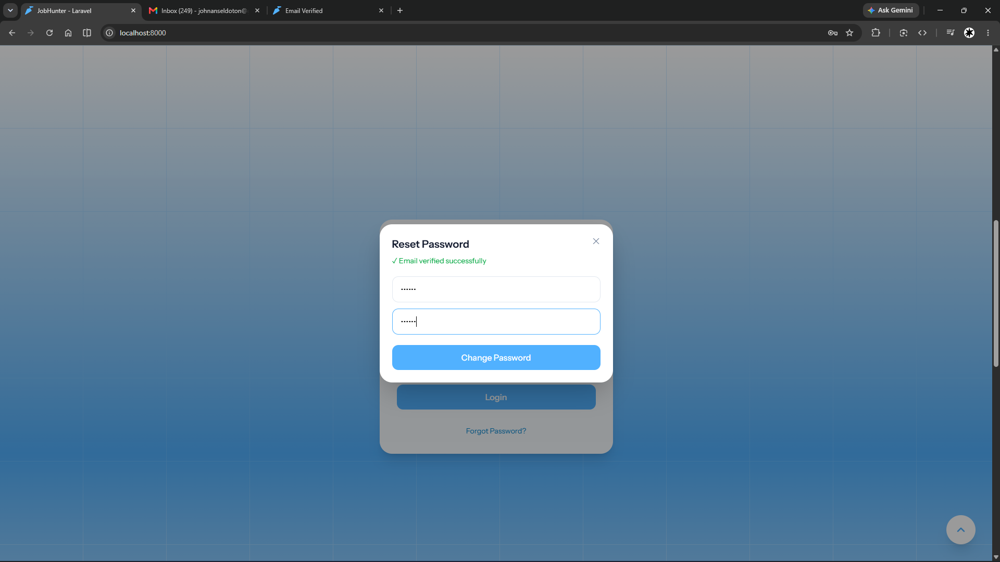

---

## Footer

The footer provides additional project information and navigation links while maintaining a consistent design throughout the application.

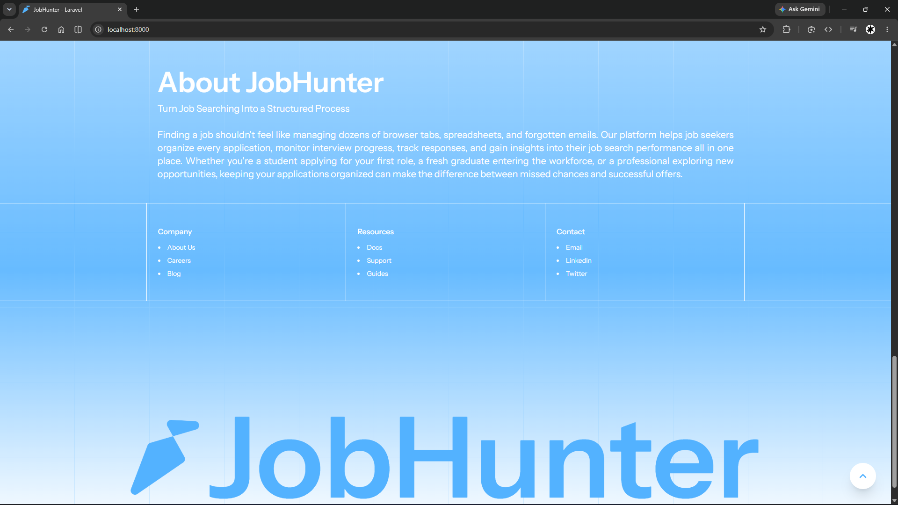

---

# Password Recovery Workflow

The password recovery workflow consists of the following steps:

1. The user selects **Forgot Password**.
2. The user enters their registered email address.
3. A verification email is sent.
4. The user opens the verification link.
5. The system validates the verification request.
6. The user creates a new password.
7. The password is updated successfully.
8. The user logs in using the new credentials.

---

# Project Structure

```text
app/
bootstrap/
config/
database/
public/
resources/
├── assets/
├── css/
├── js/
routes/
storage/
README.md
README_Assets/
```

---

# Installation

Clone the repository.

```bash
git clone https://github.com/yourusername/JobHunter.git
```

Navigate into the project directory.

```bash
cd JobHunter
```

Install PHP dependencies.

```bash
composer install
```

Install JavaScript dependencies.

```bash
npm install
```

Create the environment file.

```bash
cp .env.example .env
```

Generate the application key.

```bash
php artisan key:generate
```

Configure your database credentials inside the `.env` file.

Run the database migrations.

```bash
php artisan migrate
```

Start the Laravel development server.

```bash
php artisan serve
```

Start the Vite development server.

```bash
npm run dev
```

---

# Future Enhancements

Future versions of JobHunter may include:

- Resume Upload Support
- Company Logo Integration
- Interview Scheduling
- Calendar Integration
- Dashboard Analytics
- Resume Builder
- Email Notifications
- Dark Mode
- Export Application History
- Application Statistics Dashboard

---

# Developer

**John Ansel Doton**

Bachelor of Science in Information Technology

JobHunter was developed as a full-stack web application to demonstrate modern software development practices using Laravel, React, TypeScript, Inertia.js, and Tailwind CSS. The system was created to provide job seekers with an organized, secure, and user-friendly platform for managing job applications throughout the hiring process.

---

# License

This project is intended for educational, academic, and portfolio purposes.
